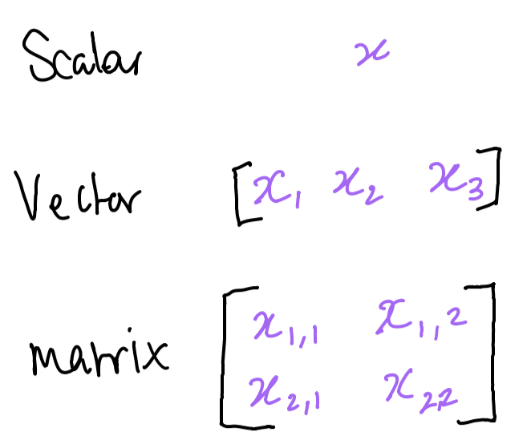
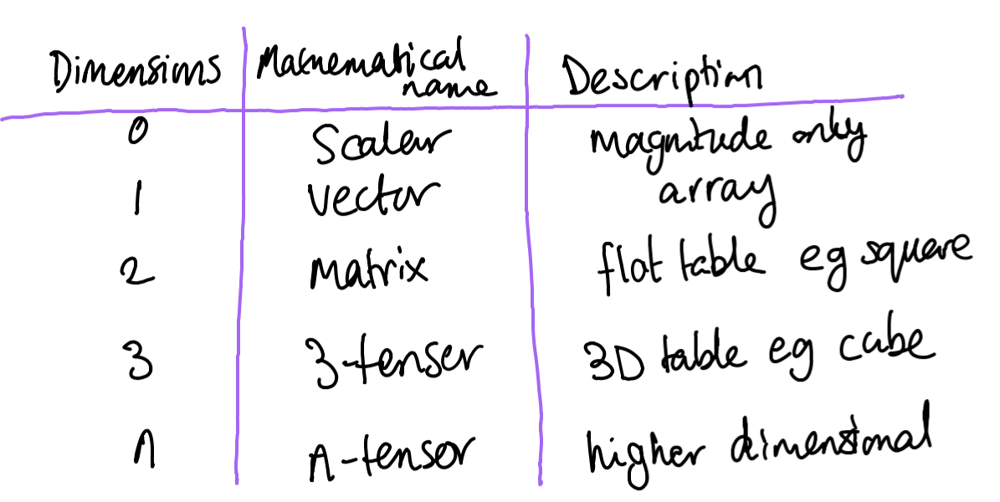
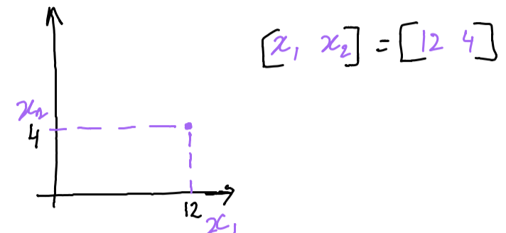
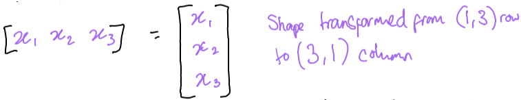
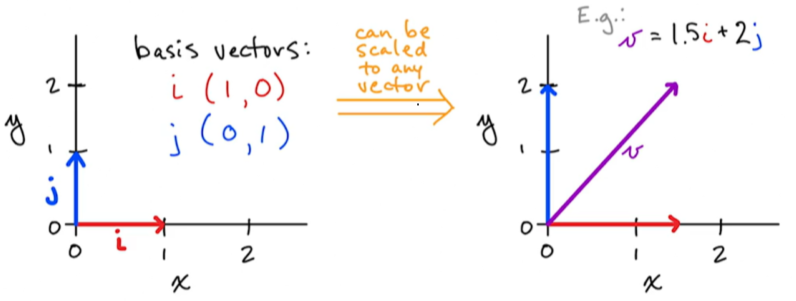

# Tensors

Tensors are machne learning generalisations of vectors and matrices to any number of dimensions.





---

## Scalars

Scalars are single number tensors that have not dimensionality. Denoted as lowercase in italics, they will be typed as integers or floats for example.

In the jupyter notbook that accompanies this course, we see examples of how scalars can be represented in base python, numpy, tensorflow, and pytorch. In each example, we see scalara creation, how to view the type, how you can perform mathematical operations with them, and when shape is asked it is empty as there is no dimensionality.

---

## Vectors and Vector Transposition

Vector tensors are one dimensional arrays of numbers (made up of scalars). They are usually denoted in lowercase, italics and bold. They are arranged in a specific order and so elements can be accesed by their indices. Vectors can also represent a point in space.

Here is an example of a vector representing a point on a 2D matrix:


### Vector transposition

Vector transposition is when you transform a row vector to a column vector or vice versa. Here is a visual representation of such a transformation: 



Arrays cannot be created in base python (lists are NOT the same as arrays), so you need to use numpy to create the array.

When writing code, you cannot transpose a 1 dimensional vector, but if it is in the format of one row of a matrix (double square brackets), you can use .T to transpose the vector back and forth (example of which is in the code).

Same methods are used to create vector tensors as scalar tensors in pytorch and tensorflow, only difference being the values you use as arguments.

---
## Norms and Unit Vectors

Vectors not only represent a point in space but they can also a magnitude and director from an origin. The magnitude of a vector refers to the size of the movement from the origin. Norms are functions that allow us to quantify this magnitude.

---
### $L^2$ Norm

The $L^2$ norm is represented by the following equation:

$$
\Vert{{x}}\Vert_2 = \sqrt{\sum_ix_i^2}
$$

Steps to perform this equation are as follows:
1. Calculate the square of all elements in the vector
2. Sum all of those values
3. Sqaure root the sum

This results in the Euclidean distance from the origin.
$L^2$ norm is the most common norm used in machine learning. 

#### Example implementation of $L^2$ norm

For the example vector where x is equal to [25, 2, 5] we can find the $L^2$ norm in base python by doing the following:

```python
(25**2 + 2**2 + 5**2)**(1/2)
```

But the easy way is to utlisise the numpy method `norm`:
```python
np.linalg.norm(x)
```

---
### Unit vectors

Unit vectors are special cases of vectors where the magnitude is equal to 1.
$$
\Vert{{x}}\Vert = 1
$$

---
### $L^1$ Norm
The $L^1$ norm is used whenever the difference between zero and non sero is critical.

$$
\Vert{{x}}\Vert_1 = \sum_i\vert{{x_i}}\vert
$$

Steps to perform this equation are as follows:
1. Calculate the absolute value of each element of the vector and sum

In python we can use `np.abs` to get absolute values.

---
### Squared $L^2$ Norm

The squared $L^2$ norm is computationally cheaper to perform that the standard $L^2$ norm:
- Squared $L^2$ is equivalent to the dot product of a vector and its transposition (represented as $x^Tx$)
- Derivatives are used to train many ML algorithms and to do this using squared $L^2$ norms requires only the individual element. If using the standard $L^2$ norms you would need the entire vector to complete/ find the derivative.

$$
\Vert{{x}}\Vert_2^2 = \sum_ix_i^2
$$

Steps to perform this equation are as follows:
1. Calculate the square of each element of the vector and sum them (no square root required)

We can use the `np.dot` method to calculate this very easily.

```python
# Base python
(25**2 + 2**2 + 5**2)

# Using Numpy
np.dot(x, x)
```

This norm is not good for when being able to distinguish between zeero and near zero is important.

---
### Max Norm ($L^\infty$)
The max norm is simply the largest absolute element within the vector.

$$
\Vert{{x}}\Vert_\infty = max_i\vert{{x_i}}\vert
$$

This would be performed in python as follows:
```python
np.max([np.abs(25), np.abs(2), np.abs(5)])
```

---
### Generalised $L^p$ norm

$$
\Vert{{x}}\Vert_p = (\sum_i\vert{{x_i}}\vert^p)^\frac{1}{p}
$$

The generalised norm can be used to derive $L^1$, $L^2$, and $L^\infty$ norms by substituting p.

$p$ must be:
- a real number
- greater than or equal to 1

Norms are used to regularise objective functions. Objective fucntions are functions that are represented by linear equations. They are used to represent optimisation problems.

---

## Basis, Orthogonal and Orthonormal Vectors

Basis vectors are vectors that can be scaled to represent any vector in any given vector space. It is typical to use unit vectors along axes of vector space.



### Orthogonal Vectors

$x$ is considered a orthogonal vector only if $x^Ty=0$.
They are at 90 degree angle to each other, assuming their norm (length/magnitude) is not equal to zero.

$n$-dimensional space has a maximum $n$ mutually orthogonal vectors.

Orthonormal vectors are veectors that are orthogonal and have unit norm.
Basis vectors are an example of orthonormal vactors as they are perpendicular and have a norm of 1.

Here is a code example:

```python
i = np.arry([0, 1])
j = np.arry([1, 0])
np/dot(i, j) # This will equal zero
```

## Matrices

Matrices are 2 dimensional arrays of number. They are denoted in uppercase, italics and bold **$X$**. They are represented in mathematical notation as $(n_{row}, n_{col})$. Having the rows before columns is considered as the height having priority over width. So as an example if **$X$** had 3 rows and 2 columns it would be represented as (3, 2).

Individual elements (scalars) are represented as uppercase italics. 

A colon can also be used to represent an entire row or column. So for example, let's say we are working with the following matrix:
$$
\begin{bmatrix}
25 & 2 \\
5 & 26 \\
3 & 7
\end{bmatrix}
$$

We can represent this also as:
$$
\begin{bmatrix}
X_{1,1} & X_{1,2} \\
X_{2,1} & X_{2,2} \\
X_{3,1} & X_{3,2}
\end{bmatrix}
$$

The left most column would be **$X_{:, 1}$**, whilst the middle row could be represented by **$X_{2, :}$**.

Nested lists are used within an array method to create matrices:
```python
np.array([[25, 2], [5, 26], [3, 7]])
```

Each nested list represents a row in the matrix.