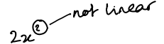
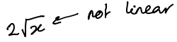
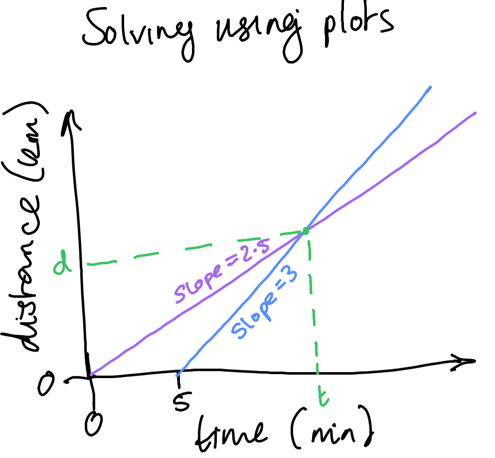
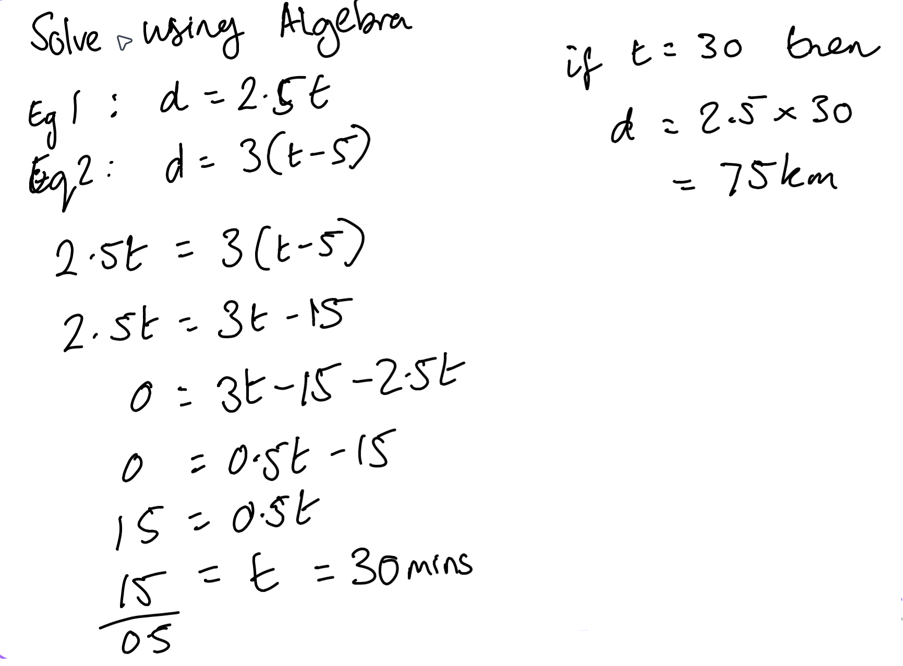
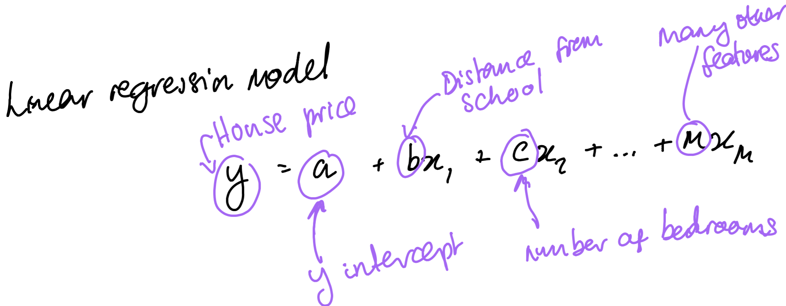

# Topic 1 - What Linear Algebra is

An example of algebra could be something as simple as this:

Examples such as these cannot be considered linear:

***
### Linear Algebra is: Solving for unknowns within a system of linear equations

A simple example of a linear problem could be:
- A cop has a 180km/h car
- A thief has a 150km/h car
- Considering that they are travelling in a straight line (not taking traffic or acceleration etc into consideration):
  - How long will it take for the cop to catch the thief?
  - What distance will they have travelled at that point?

This kind of problem can be solved by plotting the paths the two cars take:

It can also be solved algebraically:

#### Linear Algebra will always have either no solutions, 1 solution or infinite solutions

There will be no solution in the above example if both cars were travelling at the same speed.

Likewise there would be infinite solutions if they were travelling at the same speed **but** also starting at the same time.

In any linear system, there could be many equations and many unknowns in each equations. For example:

***

### Contemporary Applications of Linear Algebra

Linear alegbra has so many applications today, such as:
- Solving for unknowns in ML algorithms
- Redundancy dimensionality (PCA)
- Ranking results (eigen vectors)
- Recommenders (single value decomposition, SVD)
- NLP (SUD and matrix factorisation)
  - topic modelling
  - semantic analysis